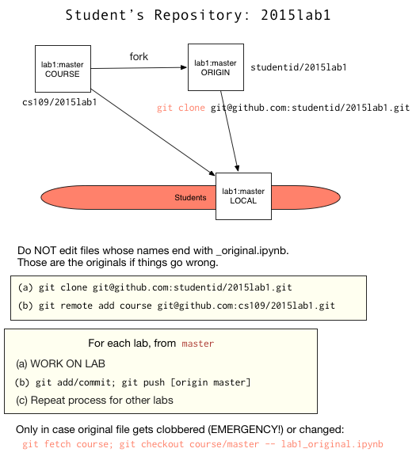

# 2015lab1

Lets talk a bit about how labs and sections work in cs109:

1. Lab Notebooks are made available every Thursday evening.
2. Lab Videos (which may not cover everything in the notebooks) are made available every Friday as well
3. In sections starting Monday morning, and running upto the next Friday, your TA will present part of the lab to you. You ought to have looked at and perhaps tried the lab over the previous weekend, and your section might reach a consensus on what you'd like your TF to focus on: please communicate this.

(Sections are 2 hours long. The first hour will be spent going over the lab, while the second if an office hour, where you can ask your TA questions about the homework, the lectures, the subject matter, and even the lab).

The labs will be made available on public github repositories, with naming schemes like `cs109/2015lab1`.

This is how you ought to work with them (our github tutorial has an example of this process on the `cs109/testing` repository):

1. First fork the lab from the github web interface. For example, the first lab is at: https://github.com/cs109/2015lab1 . The fork button is at the upper right corner of the page. Press it.
2. When it asks you where to fork the lab, choose your own github userid. The web interface will then take you to the web page for your fork. Mine is at: https://github.com/rahuldave/2015lab1 .
3. Now look for the clone url at the bottom right of the page. If you set up your ssh keys, use the ssh url, else use the https url. Mine are `git@github.com:rahuldave/2015lab1.git` and `https://github.com/rahuldave/2015lab1.git` respectively. 
4. Clone your fork down to your machine by obtaining a terminal (`/Applications/Utilities/Terminal.app` or equivalent on mac and `git-bash.exe` on windows). Change (`cd`) into an appropriate folder and clone by doing `git clone url` where the `url` is the one in step 3.
5. Add a remote for the original repository that you forked from. We'll call this remote `course`. The command for this, for example, for the first lab is: `git remote add course git@github.com:cs109/2015lab1.git` or `git remote add course https://github.com/cs109/2015lab1.git`
6. Now you have a local repository. Start the ipython notebook in the repository and run the labs. DO NOT run the notebooks ending in `_original.ipynb`. These are simply copies of the labs. We made these copies so that you can update them from our `course` remote in case we make any changes.

For Lab 1 I'd start with pythonpandas, followed by babypython, and finally git. The git notebook can be run under the ipython notebook. But the git commands can also be run directly on a terminal, which is probably the best place to do them...you can keep the notebook on the side to read as you follow along). So after once having read the tutorial, as described earlier, you now get to work through it.

When you follow along, you can add in your own notes, and try your own variations. As you are doing this, dont forget to continue doing the "add/commit/push" cycle, so that you save and version your changes, and push them to your fork. This typically looks like:
    - git add .
    - git commit -a
    - git push
    
In case we make changes, you can incorporate them into your repo by doing: `git fetch course; git checkout course/master -- labname_original.ipynb` where `labname.ipynb` is the lab in question. An "add/commit/push" cycle will make sure these changes go into your fork as well. If you intend to work on the changed file, simply copy the file to another one and work on it. Or you could make a new branch. Remember that this fork is YOUR repository, and you can do to it what you like. 

The diagram below should help elucidate the above and serve as a command cheat-sheet.

